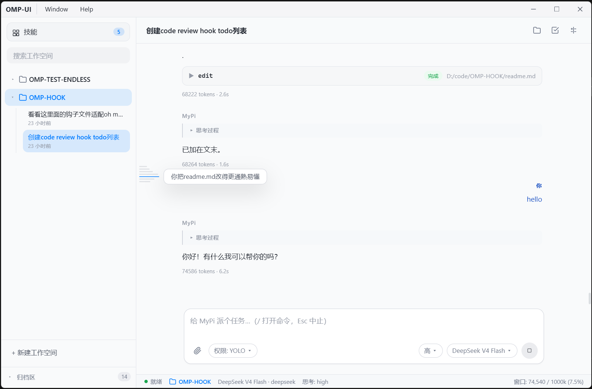

# OMP Codex (omp-gui)

[English README](./README.en.md) | 中文版

为 [oh-my-pi](https://github.com/...)（omp）打造的 Windows 桌面 GUI，仿 Codex 的交互风格，通过 `omp --mode rpc-ui` 与 omp 子进程用 NDJSON over stdio 通信。

> 本项目是 **GUI 外壳**；真正的 agent 引擎来自 [oh-my-pi](https://github.com/...)（omp）。本应用不内置 omp 二进制，运行时需要系统中已安装 omp。



## 特性

- **多会话侧栏 / 工作空间**：每会话一个独立 omp 进程，切换会话不中断生成；按目录归类、归档/恢复会话
- **文件编辑追踪**：实时显示 agent 正在编辑的文件、完成状态、token 消耗与耗时
- **模型配置面板**：读写 omp `models.yml`，支持新增/编辑模型、API Key 管理与启用白名单
- **权限模式与思考档位**：快捷切换权限策略（如 YOLO）与模型思考级别（low / medium / high）
- **Steer 实时转向**：agent 执行过程中可随时插入新指令纠偏，无需等待本轮完成
- **信息密度条（Minimap）**：聊天区右侧 14px 小地图，一眼掌握对话结构与当前位置
- **Todo 列表可视化**：解析 omp `todo` tool 的真实执行进度，分阶段展示任务状态
- **Markdown 渲染、流式输出、token/耗时统计**
- **会话自愈**：omp 异常退出时自动带 `-c` 续跑当前会话，避免聊天被拆成多个文件
- **工作空间持久化**：配置保存在 `userData`，换设备或重装后可通过工作空间列表恢复

## 交互特性详解

### Steer 实时转向

在 omp 正在执行任务（读写文件、跑命令）的中途，你可以随时输入一条新指令并作为 **steer** 发送，把当前任务方向纠偏或转向——不必等这一轮跑完再开新会话。

- 输入区提供独立的 steer 入口（图标 + 快捷键）；
- 发送后通过主进程 IPC 投递给对应会话的 omp 进程；
- 状态栏实时显示当前会话是否处于 steer 状态；
- 设置面板可配置 steer 相关行为。

### 信息密度条（Minimap）

借鉴 Codex / 现代编辑器的小地图思路，在聊天消息区右侧渲染一条 **14px 宽的纯 Canvas 色带**（零运行时依赖，仅用 `ResizeObserver` / `MutationObserver` / `scroll` 节流重绘）：

- 用户消息 → 强调色宽块；助手消息 → 中性灰窄块，一眼区分角色与密度；
- 叠加跟随滚动的视口指示框，**点击 / 拖拽**即可跳转到长对话的任意位置；
- 可滚动性阈值判定：内容不足一屏时不显示、并恢复原生滚动条，避免「双滚动条」。

## 技术栈

Electron 38 + React 18 + TypeScript 5.6 + electron-vite 5 + zustand 5。

## 前置依赖（运行时必装）

本 GUI 启动后需要调用 **omp** 命令行工具：

- 通过 [bun](https://bun.sh) 安装：`bun install -g oh-my-pi`
- 或设置环境变量 `OMP_PATH` 指向 omp 可执行文件（绝对路径）

若两者都没有，应用启动会弹出错误提示。

## 开发

```bash
npm install
npm run dev          # 启动开发模式（Electron 窗口）
```

## 构建

```bash
npm run build              # 仅编译（electron-vite build -> out/）
npm run typecheck          # tsc --noEmit 类型检查
npm run pack:portable      # 编译 + 打包成 Windows 便携版 exe（release/）
```

## 端到端冒烟测试（可选）

`scripts/` 下的脚本直接 spawn 真实 omp 验证协议流，需先设置 `OMP_PATH`：

```bash
export OMP_PATH="$(where omp)"   # Windows
node scripts/e2e-smoke.mjs
node scripts/e2e-session.mjs
```

## CI / 自动编译

仓库使用 GitHub Actions（`.github/workflows/ci.yml`）：

- **每次 push 到 `main` / 开 PR**：跑 `typecheck` + `build` 验证可编译。
- **打 `v*` tag（如 `v0.2.1`）**：在 Windows runner 上打包便携版 exe，并自动发布到 GitHub Release。

## 许可证

[MIT](./LICENSE)
