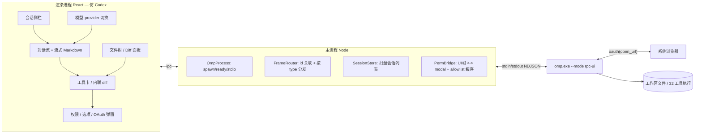

# pi_plan.md — oh-my-pi Windows GUI（仿 Codex）实施计划

> 目标：为 oh-my-pi（omp）做一个**仿 OpenAI Codex 观感与功能面**的 Windows 桌面 GUI。后端全部由 OMP 实现，UI 只做接入层。
> 技术栈：Electron + Vite + React + TypeScript。
> 接入方式：`omp.exe --mode rpc-ui`，NDJSON over stdio。
> 项目根目录：`<REPO_ROOT>`（本计划所有路径相对此目录）。
> 研究依据（已逐一核对官方文档）：`docs/rpc.md`、`docs/approval-mode.md`、仓库 `src/modes/rpc/rpc-types.ts`、`src/modes/rpc/rpc-mode.ts`、`packages/agent/src/agent.ts`，以及 README 的 RPC/SDK 章节。
> 对照参考：同目录 `plan.md`（另一 AI 的版本）。本计划在其实事求是的部分之上修正了路径、补强了权限模型与 OAuth 流程。

---

## 0. 调研结论与关键修正

1. **OMP 是终端 coding agent**（TS + Rust 原生），Windows 正式形态是 `bun build --compile` 出的原生 `omp.exe`，不是 Node 跑 TS。因此**绝不在 Electron(Node) 里 import SDK**（SDK 入口是 TS 源码、`engines: bun`），唯一稳妥路径是 **spawn `omp.exe --mode rpc`**。
2. OMP 原生支持 **`openai-codex` `oauth`** provider；`--mode rpc-ui` 会把工具卡片 / 选择器 / 对话框作为 `extension_ui_request` 帧推给宿主，宿主必须应答。这是 Codex 式审批/选项弹窗的承载机制。
3. **权限默认是 `yolo`**（全部自动批准、不弹窗）。要出现审批弹窗，spawn 时必须带 `--approval-mode write`（read/write 自动执行，exec 类如 bash/browser/ssh 才弹窗）或 `always-ask`（write+exec 都弹）。这是本计划默认采用 `write` 的根本原因。
4. 本机环境已确认：Node v23.11.0 / npm 10.8.3 / bun 已装；`@oh-my-pi/pi-coding-agent` 已发 npm（v17.0.5）。**omp 已安装并在 PATH 上**（`C:\Users\<user>\.bun\bin\omp.exe`，v17.0.5，MZ 原生可执行）。**RPC 握手已实测通过**：`omp --mode rpc-ui --no-session` 启动即输出 `{"type":"ready"}` 并持续推送 `extension_ui_request` / `available_commands_update` 帧（见 P0.1）。

---

## 1. 总体方案

### 1.1 接入方式：`omp --mode rpc-ui`

选 RPC 而非 Node SDK / ACP / TUI：

- **进程隔离**：GUI 崩不杀 agent，agent 崩不杀 GUI。
- **零 Bun 依赖**：仅依赖 `omp.exe` 二进制，Windows 分发无额外运行时。
- **完整 UI 交互帧**：`--mode rpc-ui` 发出 `extension_ui_request`（工具卡 / diff 预览 / 权限 / 选项 / OAuth），可还原 TUI 体验。
- **语言无关、强类型**：协议在 `rpc-types.ts` 强类型定义，NDJSON over stdio，Node 主进程天然适配。

### 1.2 启动参数（默认）

```
omp.exe --mode rpc-ui --approval-mode write [--cwd <工作目录 由 spawn 的 cwd 选项指定>]
```

- `--approval-mode write`：read/write 自动执行，exec 类（bash/browser/ssh/task）才弹窗 → 既有 Codex 式审批又不打断常规读写。
- 设置项「Auto-approve exec tools」勾上 → 以 `--yolo`（或 `--auto-approve`）重启，进入无人值守。
- `--cwd` 不走显式 flag，由 `child_process.spawn(..., { cwd })` 指定（与 OMP 会话目录编码逻辑一致）。
- 调试期可加 `--no-session` 先验证握手（README 示例用法），正式版按 cwd 自动 resume。

### 1.3 架构



数据流：
- 命令（renderer → main → omp.stdin）：`ipcMain.handle('rpc:send')` 收命令，主进程赋 `id` 后写 stdin。
- 事件（omp.stdout → main → renderer）：`readline` 逐行 `JSON.parse`，按 `type` 分发，经 `webContents.send` 推渲染层。
- 权限：`extension_ui_request` → 推前端 modal → 用户操作 → renderer → main → stdin 写 `extension_ui_response`。

---

## 2. 通信契约要点（实现以 `src/modes/rpc/rpc-types.ts` 为准）

### 2.1 握手（Startup）
- 子进程启动后先输出 `{"type":"ready"}` 才开始处理命令。
- 收到 ready 后立即发 `get_state` + `get_available_models` 填充 UI。
- stdin 关闭时 omp 拒绝 pending 的 host-tool/host-uri 调用并以 exit code 0 退出。
- RPC 模式默认**关闭标题自动生成**（避免额外模型调用）→ 标题 fallback 到首条 user 消息前 N 字。

### 2.2 id 关联
- 命令帧可选 `id?: string`，响应帧回显同 `id`（`RpcClient` 据此解 pending）。
- `prompt` / `abort_and_prompt` 立即 ack，但同 id 的异步错误可能稍后发。
- 未知命令响应 `id: undefined`（即便请求带 id）；解析/处理器异常 emit `command:"parse"` 且 `id: undefined`。
- `prompt` 成功响应可含 `data.agentInvoked`（`false`=本地完成未起 agent；`true`=产生 agent 生命周期事件；省略=靠 session 事件判断完成）。

### 2.3 关键输入帧（client→omp，节选自 rpc.md，完整以 rpc-types.ts 为准）
- **Prompting**：`prompt` / `steer` / `follow_up` / `abort` / `abort_and_prompt` / `new_session`
- **State**：`get_state` / `get_available_commands` / `set_todos` / `set_host_tools` / `set_host_uri_schemes` / `set_subagent_subscription` / `get_subagents` / `get_subagent_messages`
- **Model**：`set_model` / `cycle_model` / `get_available_models`
- **Thinking**：`set_thinking_level` / `cycle_thinking_level`
- **Session**：`get_session_stats` / `export_html` / `switch_session` / `branch` / `get_branch_messages` / `get_last_assistant_text` / `set_session_name` / `handoff`
- **Messages**：`get_messages`
- **Login**：`get_login_providers` / `login`
- **Bash**（并发派发，便于中途 `abort_bash`）：`bash` / `abort_bash`

### 2.4 关键输出帧（omp→client）
- `ready` —— 握手。
- `response` —— `{type:"response", command, success, data?|error}`。
- `AgentSessionEvent`（约 22 种，`rpc-types.ts` 为准）：
  - 生命周期：`agent_start` / `agent_end` / `turn_start` / `turn_end`
  - 消息：`message_start` / `message_update` / `message_end`
  - 工具：`tool_execution_start` / `tool_execution_update` / `tool_execution_end`
  - 压缩 / 重试 / 规则 / Todo / 其他：`auto_compaction_*`、`auto_retry_*`、`ttsr_triggered`、`todo_reminder`、`todo_auto_clear`、`irc_message`、`notice`、`thinking_level_changed`、`goal_updated`
- `extension_ui_request`（11 种 method，`rpc-types.ts` 为准）：
  - 需应答：`select` / `confirm` / `input` / `editor` / `cancel`
  - 单向通知：`notify` / `setStatus` / `setWidget` / `setTitle` / `set_editor_text`
  - OAuth：`open_url`
- `host_tool_call` / `host_tool_cancel` / `host_uri_request` / `host_uri_cancel`（高级：让 UI 提供宿主工具，MVP 不做）
- `available_commands_update` / `prompt_result` / `extension_error`
- 子代理帧：`subagent_lifecycle` / `subagent_progress` / `subagent_event`（需 `set_subagent_subscription`）
- 斜杠命令侧通道：`command_output` / `session_info_update` / `config_update`

### 2.5 权限机制（RPC 特有，区别于 ACP）
- RPC **不走** ACP 的 `session/request_permission`。
- 危险工具触发 `extension_ui_request` 的 `confirm`/`select`/`input`/`editor`，宿主回 `extension_ui_response`。
- 响应格式：`{value: string}` / `{confirmed: boolean}` / `{cancelled: true, timedOut?: boolean}`。
- 子代理内部以 yolo 跑、不再弹权限（外层 `task` 可能触发一次 confirm）。
- 超时由 omp 端用默认值兜底（前端收到 `cancel` 帧即自动关 modal）。
- **前提**：必须 `--approval-mode write`（或 `always-ask`）；默认 `yolo` 下这些帧不会出现。

### 2.6 会话持久化（M3）
- 存放：`~/.omp/agent/sessions/<dir-encoded>/<timestamp>_<sessionId>.jsonl`
  - `<dir-encoded>`：cwd 在 home 内 → `-<relative>`（`/\:` 替换为 `-`）；在 OS tmp 内 → `-tmp-<relative>`；其他 → legacy `--<cwd>--`。
- 格式：JSONL，首行 `SessionHeader`（含 id/cwd/title/parentSession），其余 12 种 `SessionEntry`（append-only，分支只移 leaf 指针）。附属 blob store `~/.omp/agent/blobs/<sha256>`、`history.db`(SQLite)。
- **RPC 无 `list_sessions` 命令** → 宿主自己扫盘：读 4KB header 拿标题/时间，读 32KB tail 拿 leaf 状态。
- ⚠️ 上述 `<dir-encoded>`/header 字段为 `plan.md` 所述，P0 须读 `docs/session.md` 与 `rpc-types.ts` 的 `SessionHeader`/`SessionEntry` 精确落实，不要照抄。

### 2.7 模型切换（M3）
- RPC 无切 role 命令，只能 `set_model(provider, modelId)`，或起进程时用 `--smol`/`--slow`/`--plan` flag 预设角色。
- role picker = 先 `get_available_models` 列全模型供直选具体 model；默认 `openai-codex/*`。
- 切换触发 `model_change` entry 写盘 + `notice` / `thinking_level_changed` 事件。

---

## 3. 仿 Codex 设计规格（视觉 / 交互）

- **三栏布局**：左=会话侧栏（新建/历史/搜索/重命名/删除）；中=对话流（流式 Markdown、代码高亮、工具卡内联）；右=文件树 / Diff 面板（点工具卡跳转、展示改动）。
- **深色为主**的克制配色，贴近 Codex 观感；等宽字体用于代码/路径。
- **流式体验**：`message_update` 逐字追加，自动滚底；`tool_execution_*` 实时显示工具运行状态与 bash 流式输出。
- **审批交互**：exec 工具触发 `confirm`/`select` modal（仿 Codex 的 approve），支持「Always allow this tool」写入宿主 allowlist 缓存（见 M2.6）。
- **OAuth 登录**：`get_login_providers` 列可选 provider → 用户选 `openai-codex` → `login` 触发 `open_url` 帧 → UI 用 `shell.openExternal` 拉起系统浏览器完成授权，回调由 OMP 处理。
- **状态栏**：模型/provider、contextUsage（tokens/窗口/百分比）、isStreaming、todo 进度。

---

## 4. 项目结构与脚手架（P0）

### P0.1 定位已装 omp 并验证 RPC 握手（本机已完成）
- [x] 本机 omp 已在 PATH：`omp` → `C:\Users\<user>\.bun\bin\omp.exe`（v17.0.5，MZ 原生 PE）。开发期主进程直接 spawn 系统 PATH 上的 `omp` 即可，**无需安装步骤**。
- [x] 实测握手：运行 `printf '\n' | omp --mode rpc-ui --no-session`，首行即 `{"type":"ready"}`，随后推送 `extension_ui_request`(setWidget) / `available_commands_update` 等帧，证明 rpc-ui 通道可用。
- [ ] **发布期如何取得 omp**：开发机 `~/.bun/bin/omp.exe` 是 bun 全局 bin 下的薄启动器（15KB、依赖本机 bun），**不应直接拷给最终用户**。发布版应通过 `irm https://omp.sh/install.ps1 | iex` 或 GitHub Release 取得**自包含 standalone `omp.exe`**，放入 `resources/`，由 `electron-builder` 的 `extraResources` 拷到运行目录，主进程按 `process.resourcesPath` 解析绝对路径 spawn。
- [ ] 验证 standalone 在**无 bun 的目标机**上能 `omp --mode rpc` 自包含运行（native addon、无 WSL）。

### P0.2 抓取权威类型
- [ ] 拉取 `packages/coding-agent/src/modes/rpc/rpc-types.ts` 到 `src/shared/rpc-types.ts`（同步 `RpcCommand` / `AgentSessionEvent` / `RpcExtensionUIRequest` / `RpcExtensionUIResponse` / `RpcResponse` / `RpcSessionState` 及 `SessionHeader`/`SessionEntry` 若暴露）。

### P0.3 初始化结构
```
<REPO_ROOT>\
├── package.json
├── tsconfig.json / tsconfig.node.json
├── vite.config.ts
├── electron/
│   ├── main.ts            # app 生命周期 + 创建窗口 + 起 OmpProcess
│   ├── preload.ts         # contextBridge 暴露 window.omp
│   └── omp-process.ts     # spawn / ready / stdio / exit / kill
├── src/
│   ├── main/              # 主进程逻辑（被 electron/main.ts 引用）
│   │   ├── frame-router.ts
│   │   ├── session-store.ts
│   │   ├── perm-cache.ts
│   │   └── ipc.ts
│   ├── renderer/          # React 前端
│   │   ├── App.tsx
│   │   ├── rpc-client.ts
│   │   ├── chat/ tools/ diff/ permission/ sidebar/ statusbar/ model-picker/ todo/ login/
│   └── shared/
│       ├── rpc-types.ts   # 来自 P0.2
│       └── ipc-channels.ts
└── resources/omp.exe
```

### P0.4 依赖与脚本
- [ ] 依赖：electron、react、react-dom、typescript、vite、@vitejs/plugin-react、electron-vite（主+渲染热重载）、react-markdown、remark-gfm、react-syntax-highlighter（或 shiki）、electron-builder（打包）。
- [ ] 脚本：`electron-vite dev`（开发）、`electron-vite build` + `electron-builder`（出包）。
- [ ] 日志：子进程 stderr 写 `.temp/omp-stderr.log`（按日期分文件），前端日志面板可查看。

---

## 5. 里程碑

### M1：最小回路（prompt + 流式回复）
> 验收：输入框发一句话 → 看到 omp 流式 Markdown 逐字出现；Esc 可中止；关窗杀子进程。

- [ ] `OmpProcess`：`spawn(args, cwd)` / `onReady` / `onFrame` / `onExit` / `onError` / `write(cmd)` / `kill()`；stdout 用 `readline` 逐行 parse；首帧 `ready` 触发 `onReady`；stderr 落日志；`exit` 决定重连或报错。
- [ ] `FrameRouter.send(cmd): Promise<RpcResponse>`：自动赋 `id`（`crypto.randomUUID()`），写 stdin，pending Map 5min 超时；`dispatch(frame)` 按 type 路由（ready→onReady；response→解 pending；其余→IPC 推渲染层）；`command:"parse"` 且 `id:undefined` 记日志。
- [ ] IPC：`ipc-channels.ts` 定义通道（`rpc:send` / `rpc:event` / `rpc:ui-request` / `rpc:ready` / `omp:stderr` / `omp:exit`）；`preload.ts` 暴露 `window.omp`；`ipcMain.handle('rpc:send', …)` 调 `FrameRouter.send`。
- [ ] `RpcClient`：封装 `prompt/abort/getState/getAvailableModels/getMessages` + `on(eventType, cb)` + `onUIRequest(cb)`；`response.success===false` 抛带 `command/error` 的 Error。
- [ ] 最简聊天 UI：消息列表 + 输入框；消费 `agent_start/message_start/message_update/message_end/agent_end` 合成消息流；`react-markdown`+`remark-gfm` 渲染；自动滚底；Enter 发送 / Shift+Enter 换行 / Esc `abort`。
- [ ] 握手：`onReady` 后 `getState()` + `getAvailableModels()`，存全局 store。

### M2：工具卡 + Diff + 权限
> 验收：让 omp 改文件 → 看 diff 预览 + Accept/Reject；触发 bash → 弹权限 modal 可批准/拒绝/记住。

- [ ] `ToolCard`：折叠/展开，头部工具名+状态（running/done/error）；展开区 args(JSON/pretty)+result；`read` 显路径行数、`search` 显命中数、`bash` 显命令+退出码；error 自动展开。
- [ ] 消费 `tool_execution_start/update/end`，按 `toolCallId` 在卡片累加 partialResult（支持 bash 流式）。
- [ ] `DiffView`：unified diff 增删着色；识别 `edit/write/ast_edit` 的 `result` 中 diff 字段（字段名实测确认）。
- [ ] `PermissionModal`：按 `extension_ui_request.method` 渲染 `confirm`(Yes/No+Always allow) / `select`(radio) / `input` / `editor` / `cancel`(关对应 modal)；多请求排队不并发；展示关联工具卡上下文。
- [ ] 应答回路：modal → `rpc.respondUI({type:'extension_ui_response', id, value|confirmed|cancelled})` → 主进程写 stdin；omp 超时回默认 → 前端收 `cancel` 自动关。
- [ ] `perm-cache.ts`：内存 `<toolName,'allow'|'deny'>`；「Always allow」写入；后续同工具命中则自动回，不弹；设置面板可重置。注意这是宿主 UX 层，omp 不持久化每工具 allowlist。

### M3：会话管理 + 模型切换 + OAuth（完整可用版）
> 验收：左栏见历史会话可新建/切换/resume/重命名；右上切模型；Codex 登录可用。

- [ ] `session-store.ts`：定位 `~/.omp/agent/sessions/`（Windows `C:\Users\<user>\.omp\agent\sessions\`），按 `<dir-encoded>` 扫 `.jsonl`，读 4KB header + 32KB tail（schema 以 P0.2 读到的为准）；`fs.watch` 增量更新；按 cwd 过滤。
- [ ] 侧栏 `SessionList`：标题/相对时间/消息数；当前高亮；右键 Rename/Fork/Export/Delete（二次确认）；新建触发 `new_session`。
- [ ] `switch_session` / `branch` / `set_session_name` / `export_html` 对接；resume 经 spawn 时 `cwd` 命中同目录会话自动续。
- [ ] `model-picker`：`get_available_models` 列全模型，默认 `openai-codex/*`；`set_model(provider, modelId)` 切换；per-role 预设用启动 flag。
- [ ] `login` 流程：`get_login_providers` → 选 `openai-codex` → `login` → 收 `open_url` 帧 → `shell.openExternal(url)` 拉系统浏览器完成 OAuth；回调由 OMP 处理。

### M4（可选）：文件树 / Diff 面板 / 高级
- [ ] 右侧文件树（读工作区目录，纯前端或 `bash` ls）、点击工具卡跳转、展示被改文件；`todo` 面板（`set_todos`/`get_state.todoPhases`）；Token/费用 + 日志面板。

---

## 6. 打包与分发（P5）
- [ ] `electron-builder`：`extraResources` 拷 `resources/omp.exe`；Windows 目标 `nsis` 或 `portable`；签名（如有证书）。
- [ ] 首次启动检测 `omp.exe` 存在，缺失则引导用户运行安装脚本或自动下载 Release。

---

## 7. 风险与验证清单
- [ ] **发布版 omp 自包含性**：开发机用系统已装 omp（已验证可用）；但 `~/.bun/bin/omp.exe` 是薄启动器，发布必须用 standalone 二进制并在**无 bun 的目标机**验证 `omp --mode rpc` 可跑（native addon、无 WSL）。
- [ ] **RPC 帧 schema**：P0.2 抓 `rpc-types.ts` 定类型，不靠猜；`extension_ui_request` 11 method 与 `AgentSessionEvent` ~22 种以此为准。
- [ ] **`--approval-mode write` 下 exec 弹窗、read/write 不弹**：P0.1 实测；默认 `yolo` 不弹是主要坑。
- [ ] **`openai-codex` oauth 在 Windows 的 `open_url` 浏览器回调**能否被 OMP 接住：M3 实测。
- [ ] **会话 JSONL 确切 schema / `<dir-encoded>` 规则**：P0 读 `docs/session.md` 落实，不照抄 `plan.md`。
- [ ] **`extension_ui_request` 是否覆盖所有 destructive 审批**：覆盖（见 2.5）；若某工具在 `write` 模式下仍走自动批准而 UI 想拦截，退路是用 `always-ask` 或在宿主侧自行拦（但 RPC 不提供 pre-tool 钩子，故以 approval 模式为唯一机制）。

---

## 8. 相对 `plan.md` 的改进点
1. **项目根目录**统一为 `<REPO_ROOT>`，去掉其 `OPENCODEUI\omp-gui` 子目录假设。
2. **补强权限模型**：显式说明 RPC 默认 `yolo` 不弹窗，必须 `--approval-mode write` 才有 Codex 式审批；引用 `docs/approval-mode.md` 的 tier 机制。
3. **补 OAuth 流程**：`get_login_providers` → `login` → `open_url` → `shell.openExternal`，闭环 Codex 登录。
4. **标注不确定项**：会话 JSONL `<dir-encoded>`/header 字段、diff 具体字段名，明确要求 P0 读 `docs/session.md`/`rpc-types.ts` 落实，而非直接采信。
5. **修正类型来源路径**：`rpc-types.ts` 实际位于 `packages/coding-agent/src/modes/rpc/`（非其泛称路径），并指明 `docs/rpc.md` 为权威协议文档。
6. **明确 MVP 边界**：host-tool/host-uri 回调列为高级可选，不进 M1–M3。
